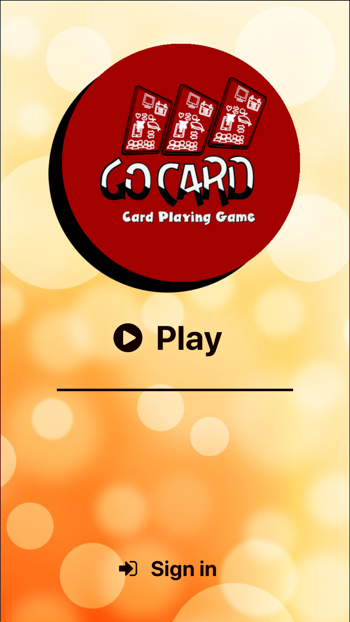
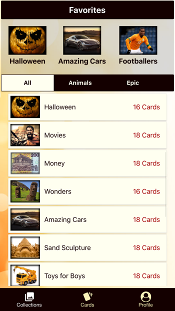
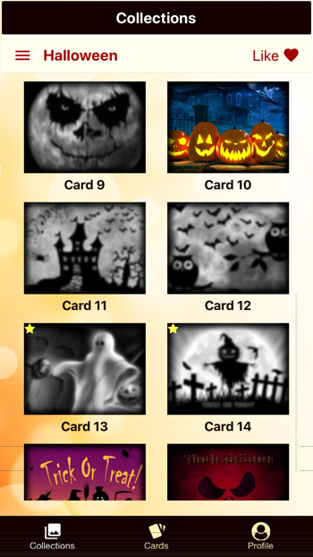
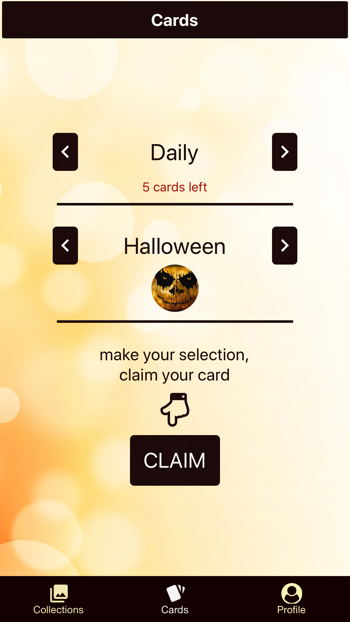

# GoCardTheGame

This is a card game where players can pull upto 5 cards a day to complete the collections they choose. 

They can pull more cards by using the achievements given in the game.

Mobile app is implemented with React-Native.

Backend service is implemented in Java with SpringBoot.

Game was uploaded both on ios and android stores, but it is not live anymore.

   
